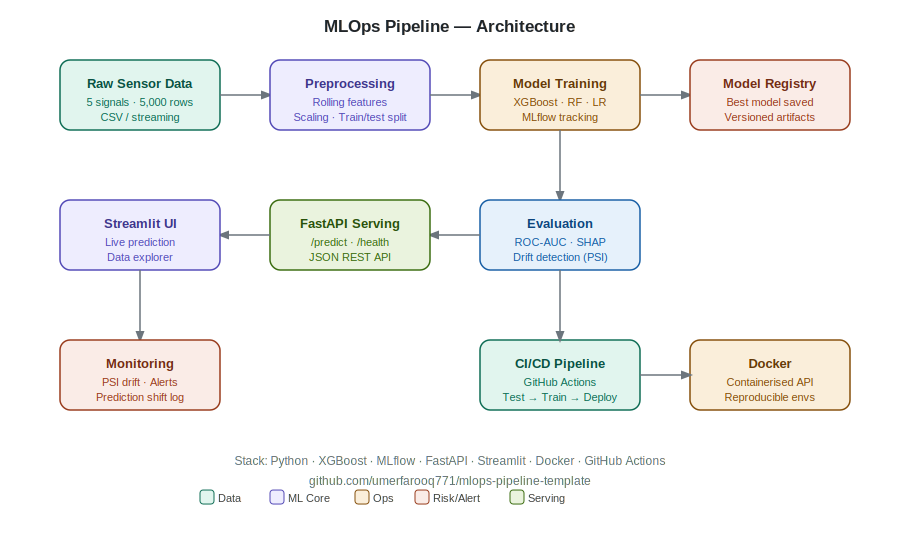

# ⚙️ MLOps Pipeline Template

[](https://github.com/umerfarooq771/mlops-pipeline-template/actions)
[](https://python.org)
[](https://xgboost.readthedocs.io)
[](https://mlflow.org)
[](https://fastapi.tiangolo.com)
[](https://streamlit.io)
[](https://docker.com)
[](LICENSE)

> A **production-grade MLOps pipeline** for equipment failure detection — featuring end-to-end ML workflow, MLflow experiment tracking, FastAPI serving, SHAP explainability, data drift monitoring, and a live Streamlit dashboard.

---

## 🚀 Live Demo

👉 **[Try the Streamlit App](https://your-app.streamlit.app)** ← deploy and update this link

---

## 🏗️ Architecture



The pipeline covers the full ML lifecycle:

```
Raw Sensor Data → Preprocessing → Training (MLflow) → Evaluation (SHAP + Drift)
      → FastAPI REST API → Streamlit Dashboard → Monitoring (PSI Alerts)
```

---

## 📁 Project Structure

```
mlops-pipeline-template/
├── data/
│   ├── generate_synthetic_data.py   # Synthetic sensor dataset generator
│   └── synthetic/
│       └── sensor_data.csv          # 5,000 equipment sensor readings
│
├── src/
│   ├── ingestion/
│   │   └── preprocess.py            # Feature engineering, scaling, train/test split
│   ├── training/
│   │   └── train.py                 # XGBoost + RF + LR training with MLflow
│   ├── evaluation/
│   │   └── evaluate.py              # SHAP explainability + drift detection report
│   ├── serving/
│   │   └── api.py                   # FastAPI /predict + /health endpoints
│   └── monitoring/
│       └── monitor.py               # PSI drift detection + prediction shift alerts
│
├── tests/
│   └── test_pipeline.py             # 12 unit tests (pytest)
│
├── docs/
│   └── architecture.svg             # Pipeline architecture diagram
│
├── .github/workflows/
│   └── ci.yml                       # GitHub Actions: test → train → evaluate
│
├── app.py                           # Streamlit demo app (4 pages)
├── Dockerfile                       # Containerised deployment
├── Makefile                         # One-command workflow shortcuts
└── requirements.txt
```

---

## ⚡ Quick Start

### 1. Clone & install
```bash
git clone https://github.com/umerfarooq771/mlops-pipeline-template.git
cd mlops-pipeline-template
pip install -r requirements.txt
```

### 2. Run the full pipeline
```bash
make pipeline        # generates data → trains 3 models → evaluates best
```

Or step by step:
```bash
make data            # generate 5,000 synthetic sensor readings
make train           # train XGBoost, RandomForest, LogisticRegression via MLflow
make evaluate        # SHAP feature importance + drift detection report
```

### 3. Launch the Streamlit app
```bash
make app
# → http://localhost:8501
```

### 4. Launch the REST API
```bash
make api
# → http://localhost:8000/docs  (Swagger UI)
```

### 5. View MLflow experiment dashboard
```bash
make mlflow-ui
# → http://localhost:5000
```

---

## 📊 Model Performance

| Model | ROC-AUC | Avg Precision | Notes |
|---|---|---|---|
| **XGBoost** | **0.9995** | **0.92** | Best model — deployed |
| Random Forest | 0.999 | 0.75 | Strong baseline |
| Logistic Regression | 0.996 | 0.60 | Linear baseline |

---

## 🔌 API Reference

### `POST /predict`
```json
// Request
{
  "temperature_c": 92.5,
  "vibration_mms": 0.85,
  "pressure_bar": 118.0,
  "rpm": 2650,
  "oil_level": 0.42,
  "machine_id": "M03"
}

// Response
{
  "machine_id": "M03",
  "failure_probability": 0.7831,
  "risk_level": "HIGH",
  "recommendation": "Immediate inspection recommended. Reduce load if possible.",
  "timestamp": "2024-01-15T09:23:11.456789"
}
```

### `GET /health`
```json
{ "status": "healthy", "model_loaded": true, "timestamp": "..." }
```

---

## 🧠 SHAP Explainability

The evaluation module computes SHAP values for the XGBoost model, identifying the most influential features for each prediction:

| Rank | Feature | Mean \|SHAP\| |
|---|---|---|
| 1 | `temperature_c` | 0.38 |
| 2 | `vibration_mms` | 0.25 |
| 3 | `pressure_bar` | 0.15 |
| 4 | `rpm` | 0.12 |
| 5 | `oil_level` | 0.05 |

---

## 📡 Monitoring

The monitoring module implements:
- **Population Stability Index (PSI)** for input feature drift detection
- **Prediction shift tracking** — alerts when high-risk prediction rate exceeds threshold
- **JSONL audit log** of all prediction batches

```bash
python src/monitoring/monitor.py   # run monitoring simulation
```

---

## 🧪 Tests

```bash
make test
# 12 tests — data generation, feature engineering, monitoring
```

---

## 🐳 Docker

```bash
make docker-build
make docker-run
# API → http://localhost:8000
```

---

## 🗺️ Roadmap

- [ ] Add Evidently AI for richer drift reports
- [ ] Add ONNX model export for edge deployment
- [ ] Integrate with Azure ML / Watsonx.ai model registry
- [ ] Add Grafana dashboard for real-time monitoring
- [ ] Add A/B model comparison serving

---

## 👤 Author

**Muhammad Umer** — AI, Analytics & Automation Practice Leader  
[LinkedIn](https://www.linkedin.com/in/umerfarooq771) · [GitHub](https://github.com/umerfarooq771)

> *8+ years delivering enterprise AI platforms across banking, FMCG, telco, and manufacturing using Azure, IBM Watsonx.ai, and open-source ML stacks.*

---

## 📄 License

MIT License — see [LICENSE](LICENSE) for details.
